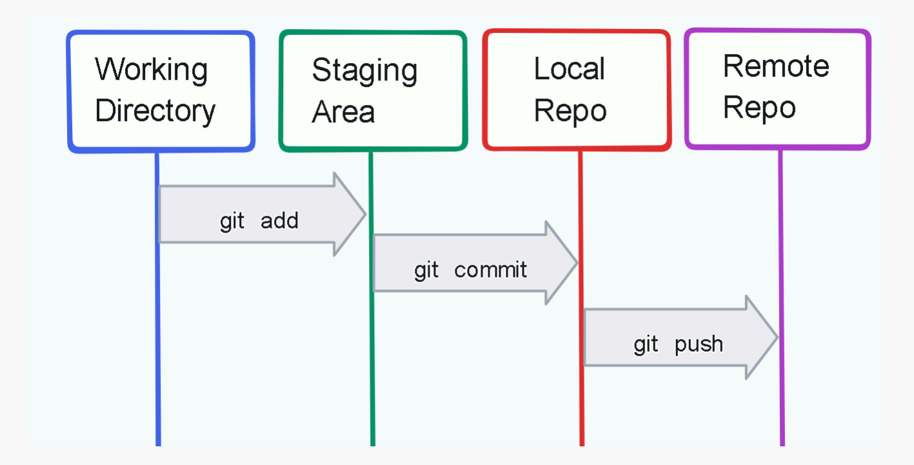

# 🧑‍💻 DSA Lab – Git & GitHub

🧑‍🏫 **Instructor:** Hamza Jawed  
📚 **Audience:** Absolute Beginners  
🎯 **Goal:** Understand Git & GitHub conceptually + use them confidently with VS Code

---

## 🚀 Let’s Begin!

Before Git, most students face problems like:

❌ Code accidentally deleted  
❌ Multiple folders like:
```

project_final
project_final_last
project_final_final_real

```
❌ Confusion in group projects  
❌ No backup of code  

👉 **Git solves all of these problems.**

---

## 🧠 1. What is Git?

💡 **Concept**

**Git** is a **Version Control System**.

That means:
- It keeps track of **changes in code**
- It saves **history of your project**
- It works on **your own computer**

🧠 **Simple Analogy**  
> Git is like **CTRL + Z**, but it remembers everything forever.

---

## 🌍 2. What is GitHub?

💡 **Concept**

**GitHub** is an **online platform** where:
- Git projects are stored
- Code is backed up
- Teams collaborate

🧠 **Analogy**
> Git = Camera 📸  
> GitHub = Google Drive ☁️ for code

---

## ⚔️ 3. Git vs GitHub (Very Important)

| Git | GitHub |
|----|-------|
| Software / Tool | Website / Platform |
| Works locally | Works online |
| Tracks code history | Stores & shares code |
| No internet needed | Internet needed |

🚨 **Git ≠ GitHub** (Most common confusion cleared here)

---

## 🧩 4. Important Git Terms (Only Basics)

| Term | Meaning |
|---|---|
| Repository (Repo) | Project folder tracked by Git |
| Commit | A snapshot of code |
| Version | Saved state of project |
| Branch | Separate line of work |
| Remote | Online repo (GitHub) |
| Collaborator | Team member with access |

---

## 🛠 5. How Git Actually Works (Mental Model)

Think of Git as a **time machine** ⏳

```

Write Code → Save Snapshot → Change Code → Save Again

```

Each save = **Commit**

You can:
- Go back
- Compare versions
- Recover deleted code

---

## 💻 6. Local vs Remote Repository

📍 **Local Repository**
- Exists on your laptop
- Managed by Git

☁️ **Remote Repository**
- Exists on GitHub
- Used for backup & sharing

```

Your Laptop (Git)  ⇄  GitHub (Remote)

```
---

## Example


---


## 🧠 7. VS Code Visualization 

VS Code makes Git **visual**.

You can:
- See changes in files
- Stage changes with one click
- Commit without typing commands
- Push code easily

👉 Git works **inside VS Code**.

---

## 🔧 8. Connecting VS Code with Git

Steps:
1️⃣ Install Git  
2️⃣ Open project in VS Code  
3️⃣ Click **Source Control icon (🔃)**  
4️⃣ Initialize repository  

Now VS Code tracks your code automatically.

---

## 🧾 17. Essential Git Commands

> ⚠️ **Important for Students**
> Don’t try to memorize commands.
> First understand **what problem each command solves**.

---

## 🔹 17.1 Check Git Installation

```bash
git --version
```

📌 Confirms Git is installed
📌 If version appears → Git is ready ✅

---

## 🔹 17.2 Initialize Git in a Project

```bash
git init
```

📌 Converts a normal folder into a **Git repository**
📌 Creates a hidden `.git` folder (Git brain 🧠)

🧠 Use **only once** per project.

---

## 🔹 17.3 Check File Status (MOST USED)

```bash
git status
```

📌 Shows:

* Modified files
* New files
* Staged files

🧠 Think of it as:

> “What is Git seeing right now?”

---

## 🔹 17.4 Stage Files (Tell Git What to Save)

Add **one file**:

```bash
git add fileName.java
```

Add **all files**:

```bash
git add .
```

📌 Moves files from **Working Area → Staging Area**

🧠 VS Code does this visually with `+` button.

---

## 🔹 17.5 Commit (Save Snapshot)

```bash
git commit -m "meaningful message"
```

📌 Saves a **version of your project**
📌 Message should explain **what changed**

✅ Good example:

```bash
git commit -m "Added stack implementation"
```

❌ Bad example:

```bash
git commit -m "update"
```

---

## 🔹 17.6 View Commit History

```bash
git log
```

📌 Shows:

* Commit ID
* Author
* Date
* Message

🧠 This proves **how much work you’ve done**.

---

## 🌍 17.7 Connect Local Repo with GitHub

```bash
git remote add origin <repository-url>
```

📌 Links your laptop project with GitHub repo

Example:

```bash
git remote add origin https://github.com/username/project.git
```

---

## 🚀 17.8 Push Code to GitHub

```bash
git push origin main
```

📌 Sends commits from **local → GitHub**

First time only:

```bash
git push -u origin main
```

🧠 Without push → GitHub stays empty ❌

---

## 🔄 17.9 Pull Latest Code from GitHub

```bash
git pull origin main
```

📌 Brings latest changes from GitHub
📌 Used when:

* Working in teams
* Code updated online

---

## 🌿 17.10 Branching Commands (Beginner)

Create new branch:

```bash
git branch feature1
```

Switch to branch:

```bash
git checkout feature1
```

Create + switch:

```bash
git checkout -b feature1
```

Check current branch:

```bash
git branch
```

---

## 👥 17.11 Collaboration Commands

Clone repository (for teammates):

```bash
git clone <repo-url>
```

📌 Downloads full project from GitHub

---

## ⚠️ 17.12 Common Errors & Meaning

| Message           | Meaning                    |
| ----------------- | -------------------------- |
| nothing to commit | No changes made            |
| not a git repo    | git init missing           |
| push rejected     | No permission              |
| fatal error       | Small mistake, don’t panic |

💡 Errors are **part of learning Git** 👍

---

## 🧠 17.13 Minimum Command Flow (Enough for Beginners)

```
git init
git status
git add .
git commit -m "message"
git push origin main
```

📌 **This flow alone is enough for your DSA labs**.

---

## 🔄 9. Basic Git Workflow (Must Remember)

```

Write Code
↓
Stage Changes
↓
Commit (Save Snapshot)
↓
Push to GitHub

```

### 🧪 Minimum Commands (Concept Only)

| Command | Purpose |
|---|---|
| `git init` | Start Git |
| `git status` | Check changes |
| `git add` | Stage files |
| `git commit` | Save snapshot |
| `git push` | Send to GitHub |

⚠️ Focus on **what happens**, not memorizing commands.

---

## 🌿 10. Branching (Beginner Level)

💡 **Concept**

A **branch** is a **separate copy of code**.

Why branches?
- Try new features safely
- Don’t break main code
- Work in teams

🧠 **Analogy**
> Photocopy of notebook to try new answers

### Types:
- `main` → Stable code
- `feature` → New work

---

## 👥 11. Collaborator Concept (Team Work)

💡 **Concept**

A **collaborator** is someone who:
- Has access to your repository
- Can push code
- Works with you

Team flow:
```

Owner → Add Collaborator → Work on Branch → Merge Later

```

This is how **real companies work**.

---

## 🧭 12. GitHub Interface Overview

Students should recognize:
- Create Repository
- Public vs Private
- README.md file
- Commits tab
- Branches tab

👉 No mastery needed, only familiarity.

---


## 🎯 14. Why GitHub Matters for Students

- Shows consistency
- Shows learning journey
- README matters more than fancy code

👉 **Simple projects + clean README = powerful**

---

## 🎓 Wrap-Up

✅ Understood what Git is  
✅ Understood what GitHub is  
✅ Learned Git workflow  
✅ Used VS Code with Git  
✅ Learned branching & collaboration  

🚀 **Next Step:** Git commands + GitHub projects in real DSA labs

---

💙 *Learning Git is not about commands — it’s about confidence.*

Happy Coding! 😄
```


