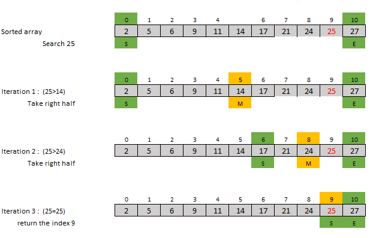
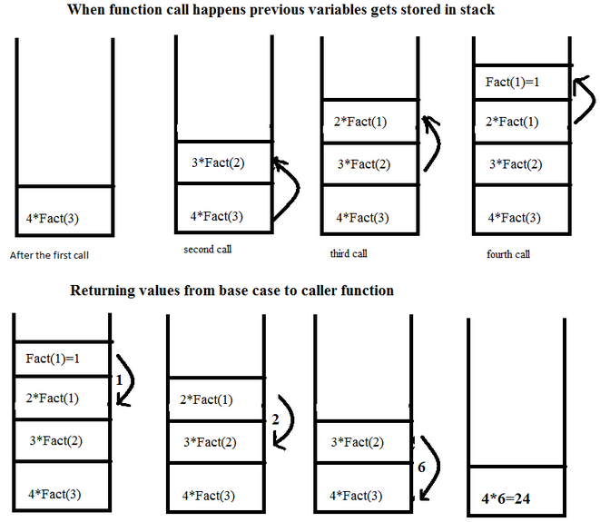

# 🚀 DSA Lab – Class 10 : Searching Algorithms + Recursion  
Welcome back developers!  
In today’s lab, we will cover **two of the most important concepts** in problem-solving:  

1️⃣ **Searching Algorithms (Linear + Binary Search)**  
2️⃣ **Recursion (Deep Understanding + Practice Problems)**  

By the end of this lecture, you will be able to:  
✔ Search data efficiently  
✔ Use recursion to reduce complex problems  
✔ Understand stack frames and call flow  
✔ Code iterative + recursive solutions  

---

# 🔍 1. Searching Algorithms

Searching means **finding an element** inside an array.  
There are two fundamental searching techniques:

```

1. Linear Search (Brute Force)
2. Binary Search (Fast, requires sorted array)

```

---

# 🧩 1.1 Linear Search

## 💡 Explanation  
Linear search checks **every element one-by-one** until it finds the target.

Perfect for:  
✔ Unsorted arrays  
✔ Small datasets  

## 🖼️ Visualization

### Linear Search (Array)


## 📘 Logic  
```

Check arr[0]
Check arr[1]
...
Check arr[n-1]

````

## 💻 Java Code
```java
public class LinearSearch {

    public static int linearSearch(int[] arr, int target) {

        for(int i = 0; i < arr.length; i++) {
            if(arr[i] == target) {
                return i;   // found
            }
        }
        return -1;  // not found
    }

    public static void main(String[] args) {
        int[] arr = {5, 12, 9, 21, 3};
        int index = linearSearch(arr, 21);

        System.out.println(index == -1 ? "Not Found" : "Found at index: " + index);
    }
}
````

## 🧠 Dry Run

Array → [5, 12, 9, 21, 3]
Target → 21

| i | arr[i] | Match?  |
| - | ------ | ------- |
| 0 | 5      | ❌       |
| 1 | 12     | ❌       |
| 2 | 9      | ❌       |
| 3 | 21     | ✅ Found |

## 🖥 Output

```
Found at index: 3
```

## 📊 Complexity

| Case       | Time |
| ---------- | ---- |
| Best Case  | O(1) |
| Worst Case | O(n) |
| Average    | O(n) |
| Space      | O(1) |

---

# 🧩 1.2 Binary Search (Iterative + Recursive)

Binary Search works only on **sorted arrays**.
It repeatedly divides the range into half.


## 🖼️ Visualization

### Binary Search (Array)


```
middle = (low + high) / 2  
Compare middle with target  
If smaller → search right half  
If greater → search left half  
```

## 🖼️ Visualization

### Binary Search (Array)




---

# 🔹 1.2.1 Binary Search (Iterative)

## 💻 Java Code

```java
public static int binarySearchIterative(int[] arr, int target) {

    int low = 0, high = arr.length - 1;

    while(low <= high) {

        int mid = (low + high) / 2;

        if(arr[mid] == target) return mid;

        else if(target > arr[mid])
            low = mid + 1;
        else
            high = mid - 1;
    }

    return -1;
}
```

---

## 🖼️ Visualization

### Binary Search (Array)


---

## 🧠 Dry Run

Array → [2, 4, 6, 8, 10, 12, 14]
Target → 8

low=0, high=6 → mid=3 → arr[3]=8 → FOUND

## 📊 Complexity

| Operation  | Time     |
| ---------- | -------- |
| Best Case  | O(1)     |
| Worst Case | O(log n) |
| Space      | O(1)     |

---

# 🧠 Searching Practice Zone

### ✔ Q1: Count occurrences of a number using Linear Search (target duplicate count)

### ✔ Q2: Find index of first and last occurrence (Linear Search)(target duplicate count but only first and last number )

---

# 🔥 2. Recursion

Recursion means **a function calling itself**.

Example:

```
void func() {  
    func();  
}
```

A recursive function always has two parts:

```
1. Base Case  → stops recursion  
2. Recursive Case  → keeps calling itself
```

---

---

## 🖼️ Visualization

### Recursion


---


# 🧠 2.1 How Recursion Works (Stack Memory)

Every recursive call stores:

* parameters
* local variables
* return address

Example call stack:

```
factorial(5)
 → factorial(4)
    → factorial(3)
       → factorial(2)
          → factorial(1)
```

Each call waits until the deeper call finishes.

---

---

## 🖼️ Visualization

### Recursion


## 🖼️ Visualization

### Recursion



---


# 🧩 2.2 Factorial Using Recursion

## 💻 Code

```java
public static int factorial(int n) {

    if(n == 1) return 1;  // base case

    return n * factorial(n - 1);  // recursive case
}
```

## 🧠 Dry Run

factorial(4)

```
4 * factorial(3)
   3 * factorial(2)
      2 * factorial(1)
          1
```

Answer → 24

---

# 🧩 2.3 Sum of Array Elements (Recursive)

```java
public static int sumArray(int[] arr, int index) {
    if(index == arr.length) return 0;
    return arr[index] + sumArray(arr, index + 1);
}
```

---

# 🧩 2.4 Fibonacci (Recursive)

```java
public static int fib(int n) {
    if(n <= 1) return n;
    return fib(n-1) + fib(n-2);
}
```

---

# 🧠 Recursion Practice Zone (Easy)

1️⃣ Print numbers from 1 to N (recursively)
2️⃣ Print numbers from N to 1
3️⃣ Count digits of a number
4️⃣ Check if array is sorted (recursively)
5️⃣ Find first occurrence of element
6️⃣ Find last occurrence
7️⃣ Print sum of digits
9️⃣ Compute power a^b recursively
🔟 Factorial & Fibonacci

---


---

# 🔍 **Linear Search – Recursive Approach**

## 💡 **Explanation**

Instead of using a loop, we use **recursion** to check elements one by one.

Each recursive call checks:

```
arr[index] == target ?
```

If not found → move to the next index:

```
linearSearchRec(arr, target, index + 1)
```

Stops when:

* Element is found → return index
* Index reaches array length → return -1

---

# 🧩 **Java Code – Recursive Linear Search**

```java
public class LinearSearchRecursive {

    // Recursive function
    public static int linearSearchRec(int[] arr, int target, int index) {

        // base case: index out of range
        if(index == arr.length) {
            return -1;   // not found
        }

        // check current element
        if(arr[index] == target) {
            return index;
        }

        // recursive call for next index
        return linearSearchRec(arr, target, index + 1);
    }

    // Main function
    public static void main(String[] args) {

        int[] arr = {5, 12, 7, 25, 3};
        int target = 25;

        int result = linearSearchRec(arr, target, 0);

        if(result == -1)
            System.out.println("Element not found");
        else
            System.out.println("Found at index: " + result);
    }
}
```

---

# 📊 **Complexity**

| Case    | Time | Space               |
| ------- | ---- | ------------------- |
| Best    | O(1) | O(n) (stack height) |
| Worst   | O(n) | O(n)                |
| Average | O(n) | O(n)                |

**Note:** Space is O(n) because each recursive call remains in call stack.

---


# 🔹 1.2.2 Binary Search (Recursive)

## 💻 Code

```java
public static int binarySearchRecursive(int[] arr, int low, int high, int target) {

    if(low > high) return -1;

    int mid = (low + high) / 2;

    if(arr[mid] == target) return mid;

    if(target < arr[mid])
        return binarySearchRecursive(arr, low, mid - 1, target);

    return binarySearchRecursive(arr, mid + 1, high, target);
}
```

---

# 🎓 Wrap-Up

🎉 Today you learned:

✔ Linear Search
✔ Binary Search (Iterative + Recursive)
✔ When to use which search
✔ What recursion is
✔ How call stack works
✔ Classic recursion problems
✔ Complete practice set


