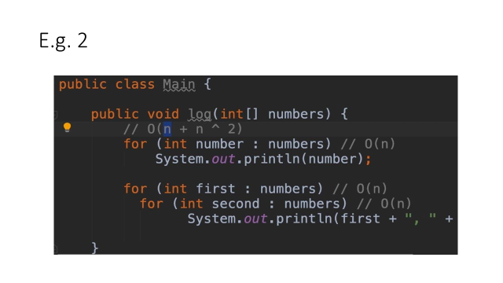
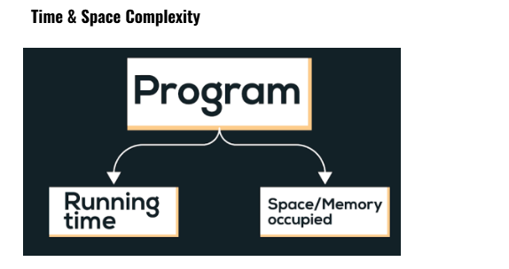

# 🚀 DSA Lab – Class 2: Time & Space Complexity + Arrays (In-Depth)

👨‍🏫 *Instructor:* **Hamza Jawed**  
📘 *Course:* Data Structures & Algorithms (Java)  
💻 *Environment:* IntelliJ IDEA / VS Code with JDK 21+

---

## 📚 Table of Contents
1. [Time Complexity](#1️⃣-time-complexity)
2. [Space Complexity](#2️⃣-space-complexity)
3. [Array Data Structure](#3️⃣-array-data-structure)
   - [Simple Insert Operation](#simple-insert-operation)
   - [Dynamic Insert Operation (Resizing)](#dynamic-insert-operation-resizing)
   - [Delete Operation](#delete-operation)
   - [Search – indexOf](#search--indexof)
   - [2D Arrays](#2d-arrays)
4. [Mini Challenge](#🏁-mini-challenge)

---

## 1️⃣ Time Complexity

💡 **Explanation**

Time complexity measures *how an algorithm’s running time grows* as the input size `n` increases.  
We usually focus on the **worst case** because it guarantees performance under all conditions.

| Case | Description | Example |
|------|--------------|----------|
| Best | Minimum time | Already-sorted array |
| Average | Typical case | Random data |
| **Worst** | **Maximum time (our focus)** | Reverse-sorted array |

---

🧮 **Common Complexities**

| Complexity | Name | Example |
|-------------|------|----------|
| O(1) | Constant | Access `arr[i]` |
| O(n) | Linear | Simple loop |
| O(n²) | Quadratic | Nested loops |
| O(n³) | Cubic | Triple loops |

💬 **Real-World Comparison**

| Input (n) | O(n) | O(n²) | O(n³) |
|------------|------|-------|-------|
| 10⁵ | 100 000 | 10¹⁰ | 10¹⁵ |

⏱ **Observation:**  
Even a small difference in complexity changes everything — an O(n³) algorithm could take **years** to finish for n = 10⁵.

---

💻 **Example – Nested Loops (O n²)**

```java
public class Main {
    public static void main(String[] args) {
        int n = 3;
        for (int i = 1; i <= n; i++) {          // O(n)
            for (int j = 1; j <= n; j++) {      // O(n)
                System.out.println(i + ", " + j);
            }
        }
    }
}
````

🧠 **Analysis:**
Inner loop runs `n` times for each outer loop → O(n × n) = **O(n²)**

🖥️ **Output**

```
1,1
1,2
1,3
2,1
2,2
2,3
3,1
3,2
3,3
```

---

🧠 **Practice**

Predict time complexity of each snippet:

```java
for (int i = 0; i < n; i++)
    System.out.println(i);
```

and

```java
for (int i = 0; i < n; i++)
    for (int j = 0; j < n; j++)
        System.out.println(i + j);
```

✅ **Solution:**

* First = O(n)
* Second = O(n²)

---

## Example


---

## 2️⃣ Space Complexity

💡 **Explanation**

Space complexity shows how much **memory (RAM)** your program uses during execution.
It includes:

1. **Input space** – memory for data provided by user
2. **Auxiliary space** – extra space your algorithm needs (variables, arrays)

| Type     | Example                   | Space Used       |
| -------- | ------------------------- | ---------------- |
| **O(1)** | `int a,b,c;`              | Constant         |
| **O(n)** | `int[] arr = new int[n];` | Grows with input |

🧩 **Tip:**
More variables or larger arrays → more space.

Loops don’t affect space unless they create new structures.

💻 **Example**

```java
int a = 5, b = 6;           // O(1)
int[] arr = new int[1000];  // O(n)
```

🧠 **Practice**
Predict space complexity for:

```java
int[] list = new int[50]; // ?
int total = 0;            // ?
```

✅ **Solution:**
O(n) and O(1)

---
---

## Example


---

## 3️⃣ Array Data Structure

💡 **Explanation**

An **Array** is a *contiguous memory block* holding multiple elements of the same type.

📗 **Features**

* Fast access → O(1)
* Fixed size once declared
* Inefficient insertion/deletion (mid-array shift needed)

📊 **Operation Complexities**

| Operation    | Complexity | Why            |
| ------------ | ---------- | -------------- |
| Access       | O(1)       | Direct index   |
| Insert (end) | O(1)       | Next slot      |
| Insert (mid) | O(n)       | Shift elements |
| Delete       | O(n)       | Shift left     |
| Search       | O(n)       | Linear scan    |

---

### Simple Insert Operation

💡 **Explanation**

If array isn’t full → insert new element at `count` index.
If full → print a warning.

💻 **Example**

```java
class MyArray {
    private int[] items;
    private int count;

    public MyArray(int length) {
        items = new int[length];
    }

    public void insert(int value) {
        if (count == items.length) {
            System.out.println("Array is full! Cannot insert " + value);
            return;
        }
        items[count++] = value;
    }

    public void print() {
        for (int i = 0; i < count; i++)
            System.out.print(items[i] + " ");
        System.out.println();
    }
}

public class Main {
    public static void main(String[] args) {
        MyArray numbers = new MyArray(3);
        numbers.insert(10);
        numbers.insert(20);
        numbers.insert(30);
        numbers.insert(40); // full
        numbers.print();
    }
}
```

🖥️ **Output**

```
Array is full! Cannot insert 40
10 20 30
```

---

### Dynamic Insert Operation (Resizing)

💡 **Explanation**

In real applications, arrays often need to **grow**.
If full → create a new array **twice as large**, copy old items, then insert the new element.
This idea is used inside **`ArrayList`** in Java.

📊 **Complexity**

* Copy step = O(n) (when resize occurs)
* Overall *amortized* complexity = **O(1)**

💻 **Example**

```java
class DynamicArray {
    private int[] items;
    private int count;

    public DynamicArray(int length) {
        items = new int[length];
    }

    public void insert(int value) {
        // if full, resize
        if (count == items.length) {
            int[] newItems = new int[count * 2];
            for (int i = 0; i < count; i++)
                newItems[i] = items[i];
            items = newItems;
            System.out.println("Array resized to " + items.length);
        }
        items[count++] = value;
    }

    public void print() {
        for (int i = 0; i < count; i++)
            System.out.print(items[i] + " ");
        System.out.println();
    }
}

public class Main {
    public static void main(String[] args) {
        DynamicArray numbers = new DynamicArray(2);
        numbers.insert(10);
        numbers.insert(20);
        numbers.insert(30); // triggers resize
        numbers.insert(40);
        numbers.print();
    }
}
```

🖥️ **Output**

```
Array resized to 4
10 20 30 40
```

---

### Delete Operation

💡 **Explanation**

Deleting means removing an element and shifting the rest left to fill the gap.
That’s why deletion = O(n).

💻 **Example**

```java
public void removeAt(int index) {
    if (index < 0 || index >= count) {
        System.out.println("Invalid index!");
        return;
    }
    for (int i = index; i < count - 1; i++)
        items[i] = items[i + 1];
    count--;
}
```

🧠 **Practice**
Delete the element at index 2 and print array.
✅ **Solution**

```java
numbers.removeAt(2);
numbers.print();
```

🖥️ **Output**

```
10 20 40
```

---

### Search – indexOf

💡 **Explanation**

Linear search scans from start to end until it finds the target.
If not found → return -1.

💻 **Example**

```java
public int indexOf(int value) {
    for (int i = 0; i < count; i++)
        if (items[i] == value)
            return i;
    return -1;
}
```

🧠 **Practice**
Find index of 30.
✅ **Solution**

```java
System.out.println("Index of 30: " + numbers.indexOf(30));
```

🖥️ **Output**

```
Index of 30: 2
```

---

## 🧮 2D Arrays

💡 **Explanation**

A **2D array** is like a table (rows × columns).
Think of it as an array of arrays.
Used in matrix operations, games, and graphics.

📘 **Syntax**

```java
int[][] matrix = {
    {1, 2, 3},
    {4, 5, 6},
    {7, 8, 9}
};
```

---

💻 **Example – Print Matrix**

```java
public class Main {
    public static void main(String[] args) {
        int[][] mat = {
            {1, 2, 3},
            {4, 5, 6},
            {7, 8, 9}
        };
        for (int i = 0; i < mat.length; i++) {
            for (int j = 0; j < mat[i].length; j++)
                System.out.print(mat[i][j] + " ");
            System.out.println();
        }
    }
}
```

🖥️ **Output**

```
1 2 3
4 5 6
7 8 9
```

---

💻 **Example – Transpose**

```java
public class Main {
    public static void main(String[] args) {
        int[][] mat = {
            {1, 2, 3},
            {4, 5, 6},
            {7, 8, 9}
        };
        System.out.println("Transpose:");
        for (int i = 0; i < mat.length; i++) {
            for (int j = 0; j < mat[i].length; j++)
                System.out.print(mat[j][i] + " ");
            System.out.println();
        }
    }
}
```

🖥️ **Output**

```
1 4 7
2 5 8
3 6 9
```

🧠 **Practice**

1. Find sum of all elements.
2. Print main diagonal elements.
   ✅ **Solution**

```java
int sum = 0;
for (int i = 0; i < mat.length; i++)
    for (int j = 0; j < mat[i].length; j++)
        sum += mat[i][j];
System.out.println("Sum = " + sum);

System.out.print("Main Diagonal: ");
for (int i = 0; i < mat.length; i++)
    System.out.print(mat[i][i] + " ");
```

🖥️ **Output**

```
Sum = 45
Main Diagonal: 1 5 9
```

---
### 🧩 Extra Practice

#### 1️⃣ Array Input & Print

💡 Use Scanner to take array input and print all elements.

```java
Scanner sc=new Scanner(System.in);
int size=sc.nextInt();

int[] nums=new int[size];

for(int i=0;i<size;i++) 
    nums[i]=sc.nextInt();

for(int i=0;i<nums.length;i++) 
    System.out.print(nums[i]+" ");
```

#### 2️⃣ Array of Names

```java

int n=sc.nextInt();

String[] names=new String[n];

for(int i=0;i<n;i++)
     names[i]=sc.next();

for(int i=0;i<names.length;i++)
  System.out.println("Name "+(i+1)+" is: "+names[i]);

```

#### 4️⃣ Check Ascending Order

```java

boolean asc=true;

for(int i=0;i<nums.length-1;i++)
    if(nums[i]>nums[i+1])
         asc=false;

System.out.println(asc? "Sorted Ascending":"Not Sorted");
```

🧠 **Complexities:**
All = O(n) time, O(n) space.

---

## 🏁 Mini Challenge

💪 Combine everything you’ve learned!

### 💻 Problem

Write a program that:

1. Takes size `n` from user.
2. Reads n integers into array.
3. Calculates:

   * Total sum and average
   * Maximum element and index
   * Time & space complexity analysis

✅ **Solution**

```java
import java.util.Scanner;

public class Main {
    public static void main(String[] args) {
        Scanner sc = new Scanner(System.in);
        System.out.print("Enter size: ");
        int n = sc.nextInt();
        int[] arr = new int[n];

        for (int i = 0; i < n; i++) {
            System.out.print("Enter element " + (i + 1) + ": ");
            arr[i] = sc.nextInt();
        }

        int sum = 0, max = arr[0], index = 0;
        for (int i = 0; i < n; i++) {
            sum += arr[i];
            if (arr[i] > max) {
                max = arr[i];
                index = i;
            }
        }

        double avg = (double) sum / n;
        System.out.println("Sum = " + sum);
        System.out.println("Average = " + avg);
        System.out.println("Max = " + max + " at index " + index);
        System.out.println("Time Complexity: O(n)");
        System.out.println("Space Complexity: O(n)");
    }
}
```

🖥️ **Output**

```
Enter size: 5
Enter element 1: 10
Enter element 2: 30
Enter element 3: 20
Enter element 4: 50
Enter element 5: 40
Sum = 150
Average = 30.0
Max = 50 at index 3
Time Complexity: O(n)
Space Complexity: O(n)
```

---

## 🎓 Wrap-Up

✅ Understood **Time & Space Complexity** (with real numbers)
✅ Implemented **Static and Dynamic Arrays**
✅ Mastered **Insert, Delete, Search**
✅ Explored **2D Arrays** – Sum & Transpose
✅ Completed a **Mini Challenge** using all concepts

---

Keep coding 🧠, keep optimizing ⚙️, and keep learning 🚀!
