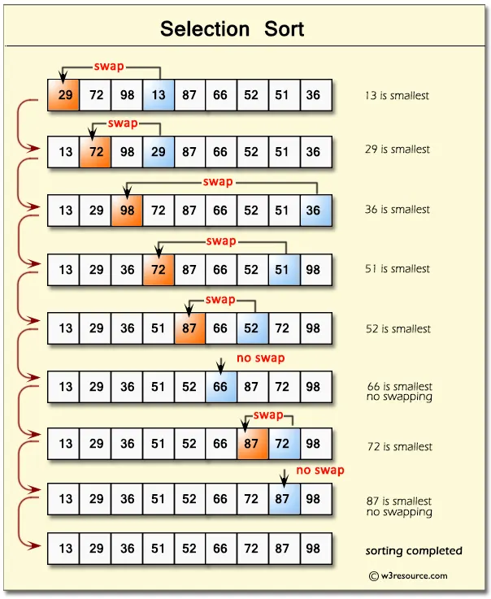

# 🚀 DSA Lecture 4 – Sorting Algorithms (Bubble, Selection, Insertion, Merge & Quick Sort)

👨‍🏫 **Welcome back, learners!**
You’ve already mastered arrays and linked lists — now it’s time to make your data *beautifully ordered*!
Today, we’re diving into one of the most fundamental and interview-favorite topics of DSA — **Sorting Algorithms**.

---

## 🎯 Lecture Objectives

By the end of this lecture, you’ll be able to:

* Understand **how and why** sorting is used.
* Compare **time and space complexity** of different algorithms.
* Implement sorting algorithms **step-by-step** in Java.
* Know **when to use which algorithm** (and which ones are used by big tech companies 👀).

---

## ⚙️ Part 1: Time & Space Complexity Overview

| Algorithm      | Best Case  | Average Case | Worst Case | Space Complexity | Stability  | When to Use                                                                 |
| -------------- | ---------- | ------------ | ---------- | ---------------- | ---------- | --------------------------------------------------------------------------- |
| Bubble Sort    | O(n)       | O(n²)        | O(n²)      | O(1)             | ✅ Stable   | For small datasets & learning basics                                        |
| Selection Sort | O(n²)      | O(n²)        | O(n²)      | O(1)             | ❌ Unstable | When swaps are costly but reads are cheap                                   |
| Insertion Sort | O(n)       | O(n²)        | O(n²)      | O(1)             | ✅ Stable   | For nearly sorted or small data                                             |
| Merge Sort     | O(n log n) | O(n log n)   | O(n log n) | O(n)             | ✅ Stable   | For large datasets, external sorting                                        |
| Quick Sort     | O(n log n) | O(n log n)   | O(n²)      | O(log n)         | ❌ Unstable | Preferred by most big techs like Google, Facebook, Amazon due to efficiency |

---

## 💡 Real-Life Connection

* 🛒 **E-commerce**: Sorting product prices or ratings.
* 🎵 **Spotify / YouTube**: Sorting songs by popularity or date.
* 🧮 **Banking Systems**: Sorting transactions by date or amount.
* 💻 **Tech Companies**:

  * Google → **Quick Sort variants**
  * Microsoft → **Hybrid Sort (IntroSort: Quick + Heap + Insertion)**
  * Python’s `.sort()` → **TimSort (Merge + Insertion)**
  * Java’s `Arrays.sort()` → **Dual-Pivot QuickSort**

---

## 🔄 Part 2: Swapping Techniques

Before sorting, we must know how to **swap elements** like a pro ⚔️

---

### 🔸 Method 1: Using a Temporary Variable

**Pseudocode:**

```
temp = a
a = b
b = temp
```

**Java Example:**

```java
int a = 5, b = 10;
System.out.println("Before Swap: a=" + a + ", b=" + b);

int temp = a;
a = b;
b = temp;

System.out.println("After Swap: a=" + a + ", b=" + b);
```

🧠 Output:

```
Before Swap: a=5, b=10
After Swap: a=10, b=5
```

---

### 🔹 Method 2: Without Using Third Variable

**Pseudocode:**

```
a = a + b
b = a - b
a = a - b
```

**Java Example:**

```java
int a = 5, b = 10;
System.out.println("Before Swap: a=" + a + ", b=" + b);

a = a + b;
b = a - b;
a = a - b;

System.out.println("After Swap: a=" + a + ", b=" + b);
```

🧠 Output:

```
Before Swap: a=5, b=10
After Swap: a=10, b=5
```

---

## 🧩 Part 3: Bubble Sort

### 🧠 Concept

Bubble Sort works by **repeatedly swapping adjacent elements** if they are in the wrong order — pushing the largest (or smallest) element to the end in each pass.

Bubble Sort repeatedly compares adjacent elements and swaps them if they’re out of order.
Each pass pushes the **largest element** to the **end** (like bubbles rising to the top 🫧).
✅ Great for teaching basics — ❌ not efficient for big data.

**📈 Time Complexity:** O(n²)
**📦 Space Complexity:** O(1)

---

## Visualization


---


### 🧮 Example:

`[5, 3, 4, 1] → [3, 4, 1, 5] → [3, 1, 4, 5] → [1, 3, 4, 5]`

---

### 🔍 Step-by-Step Dry Run

| Pass | Comparison | Action  | Result       |
| ---- | ---------- | ------- | ------------ |
| 1    | 5 > 3      | Swap    | [3, 5, 4, 1] |
| 1    | 5 > 4      | Swap    | [3, 4, 5, 1] |
| 1    | 5 > 1      | Swap    | [3, 4, 1, 5] |
| 2    | 3 > 4      | No Swap | [3, 4, 1, 5] |
| 2    | 4 > 1      | Swap    | [3, 1, 4, 5] |
| 3    | 3 > 1      | Swap    | [1, 3, 4, 5] |

---

### ✍️ Pseudocode (in English)

* Repeat passes through array
* Compare adjacent elements
* Swap if needed
* After each pass, the largest is at the end

---

### 💻 Java Example

```java
import java.util.Arrays;

public class BubbleSort {
    static void bubbleSort(int[] arr) {
        for (int i = 0; i < arr.length - 1; i++) {
            for (int j = 0; j < arr.length - i - 1; j++) {
                if (arr[j] > arr[j + 1]) {
                    int temp = arr[j];
                    arr[j] = arr[j + 1];
                    arr[j + 1] = temp;
                }
            }
        }
    }

    public static void main(String[] args) {
        int[] arr = {5, 3, 4, 1};
        bubbleSort(arr);
        System.out.println("Sorted Array: " + Arrays.toString(arr));
    }
}

```

**🖥️ Output:**
`Sorted Array: [1, 3, 4, 5]`


---

## 🧩 Part 4: Selection Sort

### 🧠 Concept

Selection Sort **selects** the smallest (or largest) element and swaps it with the element at the current index.
It makes fewer swaps but more comparisons.

✅ Easy to understand
❌ Still O(n²), so not used in large-scale apps

**📈 Time Complexity:** O(n²)
**📦 Space Complexity:** O(1)

---

## Visualization


---

### 🧮 Example:

`[5, 3, 4, 1] → [1, 3, 4, 5]`

---

### 🔍 Step-by-Step Dry Run

| Pass | Minimum Index | Swap          | Result       |
| ---- | ------------- | ------------- | ------------ |
| 1    | 3 (value 1)   | Swap 1 with 5 | [1, 3, 4, 5] |
| 2    | 1 (value 3)   | No Swap       | [1, 3, 4, 5] |

---

### ✍️ Pseudocode (in English)

* Loop through array
* Find index of smallest element
* Swap with the first unsorted element
* Move boundary forward

---

### 💻 Java Example

```java
import java.util.Arrays;

public class SelectionSort {
    static void selectionSort(int[] arr) {
        for (int i = 0; i < arr.length - 1; i++) {
            int min = i;
            for (int j = i + 1; j < arr.length; j++)
                if (arr[j] < arr[min])
                    min = j;

            int temp = arr[i];
            arr[i] = arr[min];
            arr[min] = temp;
        }
    }

    public static void main(String[] args) {
        int[] arr = {5, 3, 4, 1};
        selectionSort(arr);
        System.out.println("Sorted Array: " + Arrays.toString(arr));
    }
}
```

**🖥️ Output:**
`Sorted Array: [1, 3, 4, 5]`

---

## 🧩 Part 5: Insertion Sort

### 🧠 Concept

Insertion Sort divides the array into two parts — **sorted** and **unsorted**.
It picks one element at a time and *inserts* it into the correct position in the sorted part.
✅ Works well for small or nearly sorted data (used in small-scale data apps).

**📈 Time Complexity:** O(n²)
**📦 Space Complexity:** O(1)

---

## Visualization


---

### 🧮 Example:

`[5, 3, 4, 1] → [3, 5, 4, 1] → [3, 4, 5, 1] → [1, 3, 4, 5]`

---

### 🔍 Step-by-Step Dry Run

| Pass | Element | Action               | Result       |
| ---- | ------- | -------------------- | ------------ |
| 1    | 3       | Insert before 5      | [3, 5, 4, 1] |
| 2    | 4       | Insert between 3 & 5 | [3, 4, 5, 1] |
| 3    | 1       | Insert at start      | [1, 3, 4, 5] |

---

### ✍️ Pseudocode (in English)

* Start from index 1
* Pick current element
* Compare with previous sorted elements
* Shift larger ones right
* Insert at correct position

---

### 💻 Java Example

```java
import java.util.Arrays;

public class InsertionSort {
    static void insertionSort(int[] arr) {
        //insertion sort
       for(int i=1; i<arr.length; i++) {
           int current = arr[i];
           int j = i - 1;
               while(j >= 0 && arr[j] > current) {
                   //Keep swapping
                   arr[j+1] = arr[j];
                   j--;
               }
           arr[j+1] = current;
       }
    }

    public static void main(String[] args) {
        int[] arr = {5, 3, 4, 1};
        insertionSort(arr);
        System.out.println("Sorted Array: " + Arrays.toString(arr));
    }
}
```

**🖥️ Output:**
`Sorted Array: [1, 3, 4, 5]`

---

## ⚡ 6️⃣ Merge Sort

**🧠 Concept + When to Use:**
Merge Sort uses **Divide and Conquer** — divides the array into halves, sorts them, and merges back.
✅ Efficient & Stable
✅ Used by big techs like **Java’s Arrays.sort() for Objects**

**📈 Time Complexity:** O(n log n)
**📦 Space Complexity:** O(n)

---

## Visualization


---
### ✍️ Pseudocode (in English)

* Divide array into two halves
* Recursively sort each half
* Merge sorted halves into one

---

### 💻 Java Example

```java
import java.util.Arrays;

public class MergeSort {
    static void mergeSort(int[] arr, int l, int r) {
        if (l < r) {
            int mid = (l + r) / 2;
            mergeSort(arr, l, mid);
            mergeSort(arr, mid + 1, r);
            merge(arr, l, mid, r);
        }
    }

    static void merge(int[] arr, int l, int m, int r) {
        int n1 = m - l + 1, n2 = r - m;
        int[] L = new int[n1];
        int[] R = new int[n2];
        for (int i = 0; i < n1; i++) L[i] = arr[l + i];
        for (int j = 0; j < n2; j++) R[j] = arr[m + 1 + j];
        int i = 0, j = 0, k = l;
        while (i < n1 && j < n2)
            arr[k++] = (L[i] <= R[j]) ? L[i++] : R[j++];
        while (i < n1) arr[k++] = L[i++];
        while (j < n2) arr[k++] = R[j++];
    }

    public static void main(String[] args) {
        int[] arr = {5, 3, 4, 1};
        mergeSort(arr, 0, arr.length - 1);
        System.out.println("Sorted Array: " + Arrays.toString(arr));
    }
}
```

**🖥️ Output:**
`Sorted Array: [1, 3, 4, 5]`

---

## ⚡ 7️⃣ Quick Sort

**🧠 Concept + When to Use:**
Quick Sort picks a **pivot** and partitions the array around it.
💼 **Used by** Google, Facebook, Amazon — highly efficient for in-memory sorting!
❌ Not stable but very efficient for large datasets

These big tech companies (like Google, Facebook, Amazon) use these sorting algorithms 
**(especially Quick Sort and Merge Sort)** or their optimized variants inside their real-world systems

* In databases
* In search engines
* In large-scale data pipelines
* In built-in sorting libraries (like Java’s Arrays.sort() or Python’s sorted())


**📈 Time Complexity:** O(n log n)
**📦 Space Complexity:** O(log n)

---

### ✍️ Pseudocode (in English)

* Choose a pivot element
* Place smaller elements on the left
* Place larger ones on the right
* Recursively apply to left and right parts

---

### 💻 Java Example

```java
import java.util.Arrays;

public class QuickSort {
    static void quickSort(int[] arr, int low, int high) {
        if (low < high) {
            int pi = partition(arr, low, high);
            quickSort(arr, low, pi - 1);
            quickSort(arr, pi + 1, high);
        }
    }

    static int partition(int[] arr, int low, int high) {
        int pivot = arr[high];
        int i = (low - 1);
        for (int j = low; j < high; j++) {
            if (arr[j] < pivot) {
                i++;
                int temp = arr[i];
                arr[i] = arr[j];
                arr[j] = temp;
            }
        }
        int temp = arr[i + 1];
        arr[i + 1] = arr[high];
        arr[high] = temp;
        return i + 1;
    }

    public static void main(String[] args) {
        int[] arr = {5, 3, 4, 1};
        quickSort(arr, 0, arr.length - 1);
        System.out.println("Sorted Array: " + Arrays.toString(arr));
    }
}
```

**🖥️ Output:**
`Sorted Array: [1, 3, 4, 5]`

---

## 🧠 Recap

| Algorithm | Best For             | Key Operation           | Notes                    |
| --------- | -------------------- | ----------------------- | ------------------------ |
| Bubble    | Teaching basic swaps | Push largest each pass  | Simple but slow          |
| Selection | Few swaps            | Find min index          | Not stable               |
| Insertion | Nearly sorted data   | Insert element properly | Efficient for small data |
| Merge     | Large datasets       | Divide & merge          | Uses extra space         |
| Quick     | General purpose      | Partition & pivot       | Used in big systems      |

---


💬 **Pro Tip:**
In real systems, sorting algorithms are often hybrid — for example:
**Timsort (Python, Java)** = Merge + Insertion Sort combined!

---

🎯 **Today You Mastered:**
✅ Swapping techniques
✅ Step-by-step logic of Bubble, Selection, Insertion Sort
✅ Advanced Merge & Quick Sort
✅ Real-world usage & complexity

Keep coding 🧠, keep optimizing ⚙️, and keep sorting 🚀!

