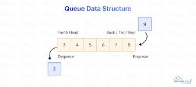
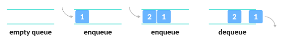

# 🚀 **DSA Lab – Class 6 : Queue (Array + Linked List Implementation)**

Welcome back, developers!
Today we explore another powerful linear data structure — **the Queue** 🔄

A **Queue** follows the rule:
🎯 **FIFO → First In, First Out**
Just like a real queue at a grocery store — the person who comes first is served first.

---

## 💡 **What is a Queue?**

A **Queue** is an ordered list where:

* **Enqueue** → Insert element at **rear**
* **Dequeue** → Remove element from **front**
* **Peek** → View the element at the **front**

🔍 **Real-life examples**

* Waiting lines
* Printer job scheduling
* Task management
* Call center requests
* OS process scheduling

---

## ⚙️ **Time & Space Complexity**

| Operation | Time (Array)           | Time (LinkedList) | Space |
| --------- | ---------------------- | ----------------- | ----- |
| Enqueue   | O(1) avg (resize O(n)) | O(1)              | O(n)  |
| Dequeue   | O(n) (shift left)      | O(1)              | O(1)  |
| Peek      | O(1)                   | O(1)              | O(1)  |
| Resize    | O(n)                   | —                 | O(n)  |

---

## 🖼️ Visualization

### Queue Structure (Array)




---

```
Front → [10][20][30][40] ← Rear
```

---

## 🖼️ Visualization





---

# 🧱 **Part 1: Queue Using Dynamic Array**

---

## 💡 Idea

We will create a **Queue** using an **Array** that:

✔ Supports enqueue, dequeue, peek, print
✔ Automatically **doubles its size** when full
✔ Dequeue removes from **front** and shifts elements left

---

## 🧩 **Pseudocode (Beginner Friendly)**

```
enqueue(value):
    if queue full:
        resize()
    insert at rear
    rear++

dequeue():
    if empty:
        print underflow
    remove element at front
    shift all elements left

peek():
    return element at front

resize():
    create new array with double size
    copy elements

isEmpty():
    return size == 0

printQueue():
    print from front to rear
```

---


## 💻 Example Code (Java)

```java
class QueueArray {
    private int[] arr;
    private int size;
    private int rear;
    private int front;

    public QueueArray(int capacity) {
        arr = new int[capacity];
        size = 0;
        front = 0;     
        rear = -1;     // nothing inside yet
    }

    // enqueue
    public void enqueue(int value) {
        if (size == arr.length) {
            resize();
        }
        rear++;
        arr[rear] = value;
        size++;

        System.out.println(value + " enqueued");
    }

    // dequeue
    public int dequeue() {
        if (isEmpty()) {
            System.out.println("Queue Underflow");
            return -1;
        }

        int removed = arr[front];   // arr[0]

        // shifting
        for (int i = 0; i < rear; i++) {
            arr[i] = arr[i + 1];
        }

        rear--;
        size--;

        return removed;
    }

    // peek
    public int peek() {
        if (isEmpty()) {
            return -1;
        }
        return arr[front];
    }

    // check empty
    public boolean isEmpty() {
        return size == 0;
    }

    // resize
    private void resize() {
        int newSize = arr.length * 2;
        int[] newArr = new int[newSize];

        for (int i = 0; i < size; i++) {
            newArr[i] = arr[i];
        }

        arr = newArr;
        System.out.println("Queue resized to " + newSize);
    }

    // print
    public void printQueue() {
        System.out.print("Queue: ");
        for (int i = 0; i <= rear; i++) {
            System.out.print(arr[i] + " ");
        }
        System.out.println();
    }
}
```

---

## 🧠 Dry Run Example

| Step | Operation   | Queue Content | Front | Rear | Size |
| ---- | ----------- | ------------- | ----- | ---- | ---- |
| 1    | enqueue(10) | 10            | 0     | 0    | 1    |
| 2    | enqueue(20) | 10 20         | 0     | 1    | 2    |
| 3    | enqueue(30) | 10 20 30      | 0     | 2    | 3    |
| 4    | dequeue()   | 20 30         | 0     | 1    | 2    |
| 5    | enqueue(40) | 20 30 40      | 0     | 2    | 3    |

---

## 🖥 Output

```
10 enqueued
20 enqueued
30 enqueued
Removed: 10
40 enqueued
50 enqueued
60 enqueued
Queue size doubled to 6
Queue: 20 30 40 50 60
```

---


## 🖼️ Visualization

### Queue Structure (LinkLIst)


---

# 🌿 **Part 2: Queue Using Linked List**

---

## 💡 Idea

Linked List Queue is 100% dynamic.

✔ No resizing
✔ No shifting
✔ Enqueue at **rear**
✔ Dequeue from **front**

---

## 🧩 **Pseudocode**

```
enqueue(value):
    create node
    if empty:
        front = rear = node
    else:
        rear.next = node
        rear = node

dequeue():
    if empty: print underflow
    remove front node
    front = front.next

peek():
    return front.data

printQueue():
    loop from front to rear
```

---

## 💻 **Java Code – Queue Using Linked List**

```java
class QueueLinkedList {
    private Node front;
    private Node rear;

    public class Node {
        int data;
        Node next;
        Node(int data){
            this.data = data;
            this.next = null;
        }
    }

    // enqueue
    public void enqueue(int value) {
        Node newNode = new Node(value);

        if (rear == null) {
            front = rear = newNode;
        } else {
            rear.next = newNode;
            rear = newNode;
        }
        System.out.println(value + " enqueued");
    }

    // dequeue
    public int dequeue() {
        if (front == null) {
            System.out.println("Queue Underflow");
            return -1;
        }

        int removed = front.data;
        front = front.next;

        if (front == null) rear = null;

        return removed;
    }

    // peek
    public int peek() {
        if (front == null) return -1;
        return front.data;
    }

    // print queue
    public void printQueue() {
        System.out.print("Queue: ");
        Node temp = front;
        while (temp != null) {
            System.out.print(temp.data + " ");
            temp = temp.next;
        }
        System.out.println();
    }
}
```

---

# ⚖️ **Comparison Table**

| Feature  | Array Queue (Resizable) | Linked List Queue |
| -------- | ----------------------- | ----------------- |
| Memory   | Contiguous, resized     | Fully dynamic     |
| Dequeue  | O(n) (shift)            | O(1)              |
| Enqueue  | O(1) / resize → O(n)    | O(1)              |
| Speed    | Slower dequeue          | Faster            |
| Overflow | After resizing → None   | Never             |

---

# 🧩 **Mini Practice Challenge Zone**

Strengthen your queue concepts with these problems 👇

---

## 🧮 **1. Find Maximum Element in Queue**

```java
public int findMax() {
    int max = Integer.MIN_VALUE;
    while (!isEmpty()) {
        int val = dequeue();
        if (val > max) max = val;
    }
    return max;
}
```

---

## ➕ **2. Find Sum of All Elements**

```java
public int findSum() {
    int sum = 0;
    while (!isEmpty()) {
        sum += dequeue();
    }
    return sum;
}
```

---

## 📊 **3. Count Elements Without Using Size Variable**

```java
public int countElements() {
    int count = 0;
    while (!isEmpty()) {
        dequeue();
        count++;
    }
    return count;
}
```
---

# 🏁 **Wrap-Up**

By the end of this lab, you learned:

✔ What a Queue is
✔ Operations: Enqueue, Dequeue, Peek
✔ Queue using Array (with resizing)
✔ Queue using Linked List
✔ Complexity comparison
✔ Real-life usages
✔ Mini challenges to strengthen concepts

---